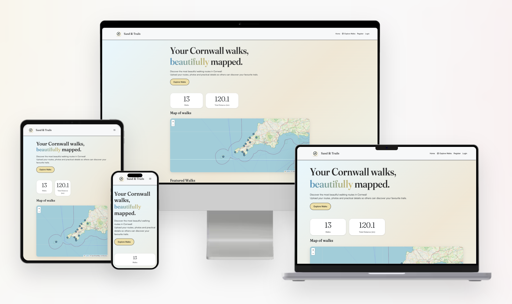
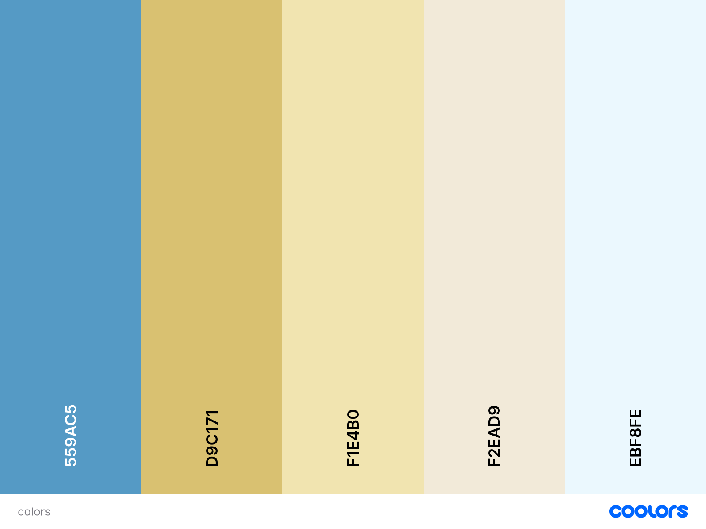
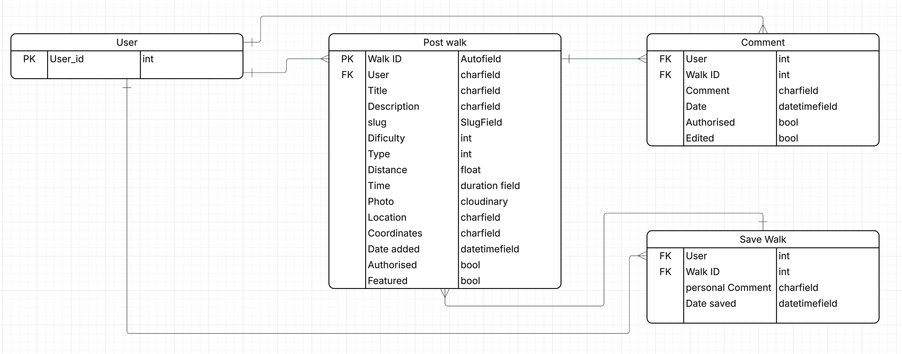
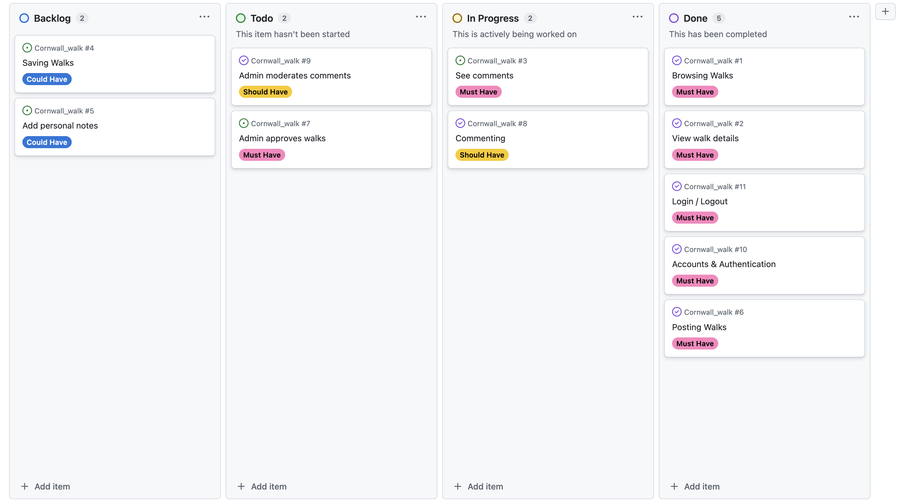
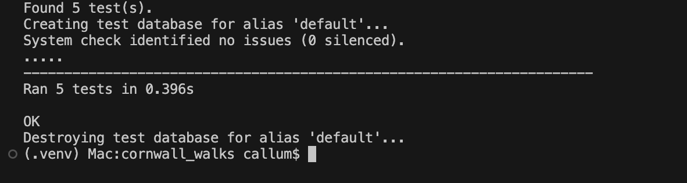
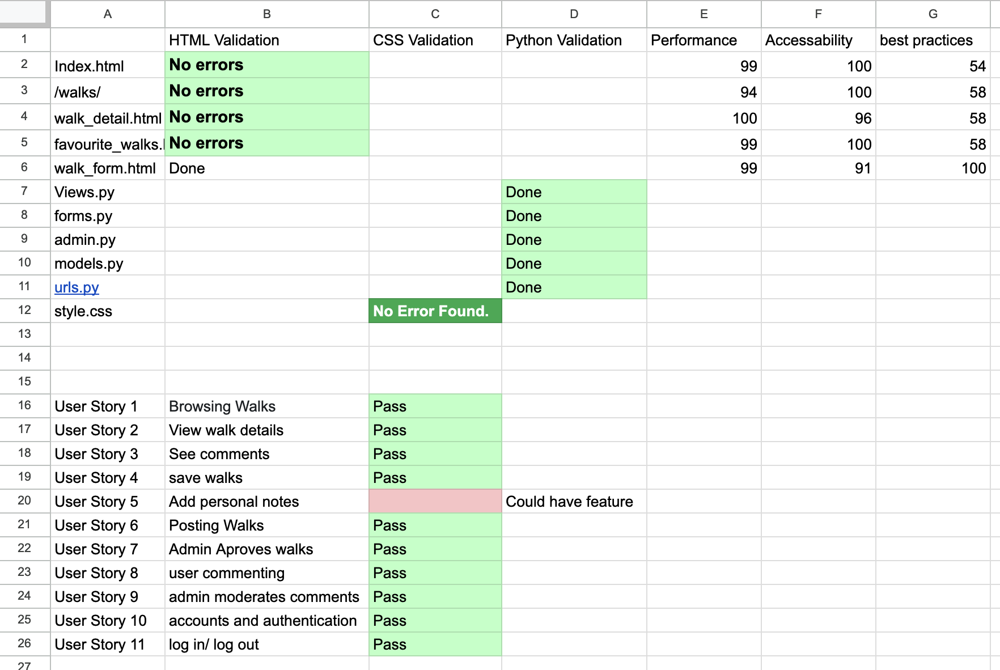
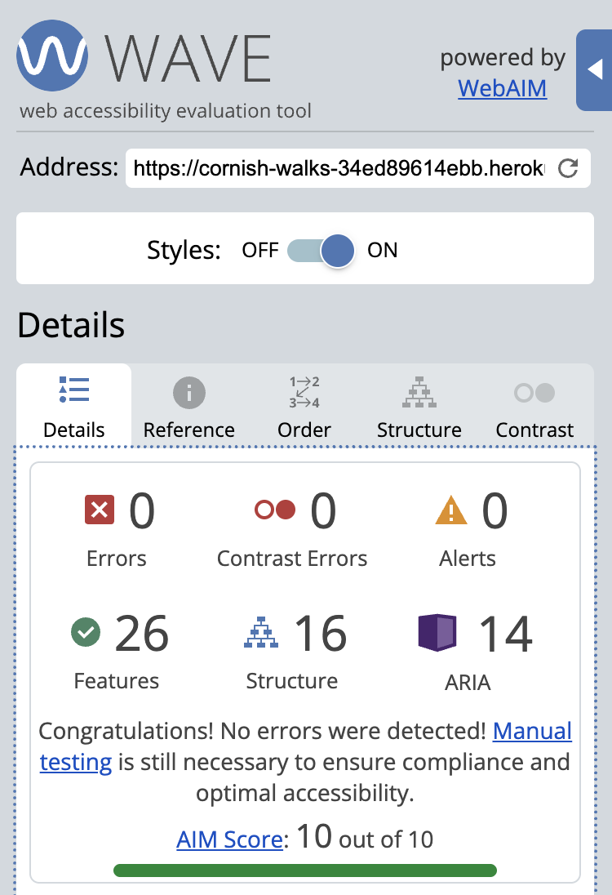

# Sand & Trails

## A community platform where hikers can discover, share, and discuss the most beautiful walking routes across Cornwall.

Sand & Trails is a community platform dedicated to discovering and sharing the most beautiful walking routes across Cornwall. Whether you're a seasoned hiker or exploring new trails, the platform allows users to browse existing walks complete with detailed information, photos, and practical details. Users can also contribute their own favorite routes to help others discover hidden gems across the Cornish coastline and countryside. The community aspect is strengthened through an integrated commenting system, enabling hikers to share experiences, tips, and recommendations with fellow trail enthusiasts.

### features

- User uploadable walks from around Cornwall.
- Homepage has a box counting the amount of walks uploaded and total KM.
- interactive map to see where the walks are located.
- Users can favourite walks.
- Users can comment on all walks.
- Admin can aprove walks and comments.
- Users can order all walks by length, time, name, date.

### Deployment

Live site: https://cornish-walks-34ed89614ebb.herokuapp.com/

### Local setup VS code:

Local Setup:

Clone the repo.

Create and activate venv:
python -m venv .venv .venv\Scripts\activate

Install:
pip install -r requirements.txt

Create env.py with:
SECRET_KEY
DATABASE_URL 
CLOUDINARY_URL

Migrate:
python manage.py migrate

Create Procfile: 
web: gunicorn run_wild.wsgi

Create superuser:
python manage.py createsuperuser

Run:
python manage.py runserver

### Heroku
1 Create Heroku app

2 Set Environment Variables in Heroku Config Vars

- SECRET_KEY
- DATABASE_URL
- CLOUDINARY_URL

3 Remove DISABLE_COLLECTSTATIC from Heroku config vars if it is set

4 Run collectstatic - python3 manage.py collectstatic

5 Deploy from GitHub

### Security Notes

- Verify DEBUG is False in production
- Keep env.py in .gitignore
- Ensure sensitive data is not in version control
- Use strong, unique secret key
- Never commit sensitive information

## Design

Sand & Trails is a user friendly, mobile first, responsive website using HTML5, CSS3, Bootstrap 5, JavaScript and Python. 

### Color palette

A nature inspired color palette.

### User Features:

- All users can view walks and their details.
- Create an account, log in, and log out securely using Django-Allauth.
- Authenticated users can add a walk to the website.
- Authenticated users can comment on all walks. They can edit and delete their own comments.
- Admin account can authorise walks and comments before other users can view them.

### Database

I have configured a secure Django web framework with a connected PostgreSQL database and custom models for the application. I used the ERD bellow to plan the structure for my database models.

Primary key (comment id) and edit date missing from the comments model in the ERD.

a Favourites line missing from postwalk in the ERD.

The save walk model isnt implemented yet.

### CRUD functionality
Full CRUD functionality is implemented and tested with logged-in users able to:

Create:
- Use a form to post a walk
- add comments to a walk item
- a user can add a walk to their favourites

Read
- can read their own un-authorsed comments
- view all walks
- a user can view their own favourited walks

Update
- edit their comment

Delete
- a User can delete their own comment

### User Stories

I created user stories to prioritise the most important features using the must have, could have and should have catagory tags. This allowed focus to be on the most important features and helped to achieve the MVP in the timeframe.

My User stories can be found <a href="https://github.com/users/cal129/projects/5">here</a>

A few examples bellow:
---
A visitor wants to browse a list of walks to find something interesting.

Acceptance Criteria:

• The home page displays a list of walks.

• Each walk shows title, location, distance, and difficulty.

• The list loads automatically when the page opens.

---

A visitor wants to view full details of a walk.

• Clicking a walk opens a detail page.

• The page shows description, distance, time, location, and difficulty.

• The page loads without requiring login.

---

A logged‑in user wants to comment on a walk.

Acceptance Criteria:

• A comment box is available when logged in.

• Submitted comments are stored as “pending approval.”

• Users can see their own pending comments.

---

### I used the agile method of "Backlog, To do, In progress and Done" to keep track of user stories and features.

https://github.com/users/cal129/projects/5

### Wire Frames
Homepage wire frame design on desktop and mobile

List of walks page wireframe

walk details wireframe

## Notifications and confirmations

I have added clear notification messages that inform users of data changes and confirmations to ensure they do not make deletions by accident.

## Testing

I created 5 automated tests to test my form and and views.

I then Manually validated the HTML, CSS, Python and did lighthouse testing.

The best practices score is mostly affected by cloudinary.

Walk_form.html validation errors are to do with summernote.

The python errors, are to do with line too long.

User story 5 is noot part of the MVP and will be implemented in a later version.

**Web Accessibility** evaluation tool returned no errors or alerts

## Use of AI

In this project, I used AI in a few ways to help my build the website.

- Design

Using co-pilot to design the logo and favicon. 

help with creating user stories.

- Explanation 

Asking what a specific line or block of code does.

- code generation. 

Asking for a step by step way of implementing a feature.

Asked ai to suggest aria labels i might have missed.

- Debugging 

Pasting in errors to find a suggested solution.

### The first week of the project I limited ai to just helping with fixing errors and bugs in the code along with the pre project planning. I did this so I could fully understand the code and the organisation. Later in the project I used it to help with coding and implementing features.I found it often wanted to add css styling within the html file.

## Future development

In the next versiion of sand & trails website i would like to add the following features.
- users can add their own private comments to the walks
- add a date of when they did it
- add a overall rating system
- add a search function eg by area
- tags or key words search or ordering

## credits

interactive Map  https://leafletjs.com - using coordinates to add a pin.

weather api  https://openweathermap.org/api - using coordinates to find local weather.

Google Fonts (web fonts) — https://fonts.google.com

Django Summernote (rich text editor) — https://github.com/summernote/django-summernote

Django Allauth (authentication) — https://github.com/pennersr/django-allauth

Django documentation.

Bootstrap documentation.

Cloudinary documentation.

Heroku deployment documentation.

Lucidchart for ERD design tools.

Balsamiq for wireframes.

Code Institute Instructors & Support